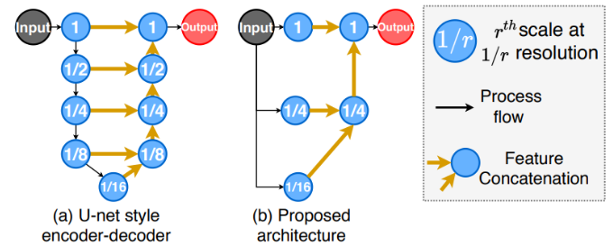

# Ablation study of “Restoring Extremely Dark Images in Real-Time”

Group 13 | CS4240 Deep Learning | Delft University of Technology


<table>
  <tr>
   <td>Demi Breen
<p>
<a href="mailto:d.breen@student.tudelft.nl">d.breen@student.tudelft.nl</a>
<p>
4591380 
   </td>
   <td>Sebastiaan Timmer
<p>
<a href="mailto:s.j.timmer@student.tudelft.nl">s.j.timmer@student.tudelft.nl</a>
<p>
4498151 
   </td>
   <td>Guus de Bakker
<p>
<a href="mailto:g.debakker@student.tudelft.nl">g.debakker@student.tudelft.nl</a>
<p>
4927028
   </td>
  </tr>
</table>


---


## Introduction

This blog post provides an overview of the paper _Restoring Extremely Dark Images in Real Time_ by Mohit Lamba and Kaushik Mitra in 2021. In their paper, Mohit and Kaushik propose a new deep learning architecture that is able to quickly restore extreme low-light single image images. Not only do they claim that their architecture is fast and lightweight, they also claim that the restoration quality is at par with the current state-of-the-art computationally intensive models. 

This blog post will briefly discuss the proposed architecture, followed by the steps taken to get their code running, and the performed ablation study. A link to the original author and the authors github page can be found below:


<table>
  <tr>
   <td>Paper:
   </td>
   <td><a href="https://openaccess.thecvf.com/content/CVPR2021/papers/Lamba_Restoring_Extremely_Dark_Images_in_Real_Time_CVPR_2021_paper.pdf">https://openaccess.thecvf.com/content/CVPR2021/papers/Lamba_Restoring_Extremely_Dark_Images_in_Real_Time_CVPR_2021_paper.pdf</a> 
   </td>
  </tr>
  <tr>
   <td>GitHub
   </td>
   <td><a href="https://github.com/MohitLamba94/Restoring-Extremely-Dark-Images-In-Real-Time">https://github.com/MohitLamba94/Restoring-Extremely-Dark-Images-In-Real-Time</a> 
   </td>
  </tr>
</table>


---


## Proposed architecture


### General structure

Conventionally there is a tradeoff between low latency networks with few model parameters and recovery quality. Previous research mostly focussed on the restoration quality and forsaked the model speed and computational efficiency. They use sequential data processing and make the output of the previous convolution block the input of the next. This can be seen in figure 1a. 

Using this architecture, the only two ways of speeding up the model is to perform faster hardware operations, or reduce the number of operations and reduce the network performance. This paper proposes the architecture parallelism which can be seen in figure 1b. Using this method, one can perform the processes of various scale-spaces in parallel. The authors claim that this allows for an additional 30% speedup without any compromises on the restoration quality. 




Figure 1: Previous vs new architectures


### Novel architecture

Figure 2 shows the proposed novel architecture. It performs parallel operations on three scales:


* Low Scale Encoder (LSE) at 1/2 resolution
* Medium Scale Encoder (MSE) at 1/8 resolution
* Higher Scale Encoder (LSE) at 1/32 resolution

The yellow squares indicate convolutional layers and the red squares indicate channel shuffle and group convolutions. Thus the LSE only has one convolutional layer. The MSE acts like a residual block with two times four convolutional layers. Lastly there is the HSE. Since the HSE operates at the lowest resolution, the computation required to perform operations is low. Therefore, most convolutional layers are located here. It also contains three Residual Dense Blocks which will be discussed in the next section. The outputs of the three encoders are fused together by Fuse Block 1 and Fuse Block 2. 


Figure 2: Novel architecture


### Residual Dense Block (RDB)

The residual dense blocks are used as building blocks for the HSE. Residual Dense Blocks are commonly used to extract local features using the densely connected convolutional layers. It contains direct connections between the input of one convolutional layer to the next and uses non-linear rectifiers after each convolution. The excessive use of these non-linear rectifiers have been criticized in recent works. However, due to the few convolutions and non-linear activations in the proposed architecture the additional non-linearity is beneficial.

The authors of this paper do however propose a modification to the original RDB. They claim that this will provide better restoration quality whilst maintaining the same time-memory complexity. Figure 3 shows the difference in architecture. The authors call their novel proposed Residual Dense Block RDB*.


Figure 3: Original vs proposed Residual Dense Block (RDB)


---


## Getting the code working


### Requirements

The code was tested on Ubuntu 16.04 LTS and google colab with pytorch 1.4. To reproduce this paper two other libraries were necessary besides the standard libraries, namely rawpy and ptflops. So the github stated that for a quick demo the following code needed to be run. 


```
pip install rawpy
git clone https://github.com/MohitLamba94/Restoring-Extremely-Dark-Images-In-Real-Time.git
cd Restoring-Extremely-Dark-Images-In-Real-Time
python demo.py
```


Since we wanted to retrain the model for ablation studies we also needed the 25GB dataset of Sony images. We decided on the Sony images instead of the Fuji database since this was also used in the paper. 

Besides the previously mentioned requirements, we also needed large memory and computational power to run this code.


### L**inux** dual boot

At first we tried to get the code running on a windows laptop dual booted with Linux Ubuntu. We cloned the github of Mohit Lamba with the code. Next we downloaded only the zipped Sony dataset (25 GB) from the following github page:

[https://github.com/cchen156/Learning-to-See-in-the-Dark](https://github.com/cchen156/Learning-to-See-in-the-Dark) 

Next, we ran the following command in the terminal to unzip the data: 

$ unzip Sony.zip

The files started to unzip, but after a while a memory error occurred.  The disk space of the memory partition reserved for the Linux dual boot was full. After trying for an entire evening to increase this partition size, we gave up and went looking for an alternative storage solution. That is we got the idea to use our Google Drive to store the data.


### Google Collaboratory

As mentioned before the dual boot did not have enough storage to unzip the Sony image file (25GB), containing all the images that we needed. So we decided to change to Google Collaboratory. Our Google Drive did also not have enough room left to download the zip and then unzip it, but we decided to buy more storage on Google Drive, because we thought that a lack of memory would be our main issue. After fixing the memory issue, we tried to run the demo.py. We got some minor errors, about missing libraries but nothing major. After we got the demo.py running, we needed to move on to the training of the network. Since we needed a baseline, we tried to first get it training without any changes to the original code. We only changed the path to the location of the Sony images in our drive. Then we got an error, that the value for ta was missing, and we dug further into the code to find out where this parameter was called and what was missing. Comparing it to the common_clasess.py of the SID we saw that the _ta_ was about the gt_amplification and we added the following lines of code.


After the addition of these lines, the error disappeared. Then the train.py started to begin with the image downloading, which resulted in a self-killing ^C. We worked out that this self destruction was because Google Collabatory did not have enough RAM to proceed the downloading procedure. This was a major setback, because now we had to look into Google Cloud platform and VM’s which we were definitely not familiar with.


### Google Cloud Platform

Because of the lack of process powers of Google Collaboratory we had to use the servers of Google using the Google Cloud Platform. This is a platform which uses the drivers of Google all over the world, but it is not free. Luckily it was possible to get 100 free credits from the TU Delft. GCP was a program that we had never used before. So learning how to start a VM, which CPU and RAM to choose and which programs to download was quite a journey.

First we chose a VM that still did not have enough storage so a new VM was necessary. Then we had the right RAM and CPU and it was possible to download and unzip the data. However, a new problem arose about the drivers installed on the VM. The right drivers were not installed and that resulted in a major error in the training process. The CUDA and Nvidia driver were not working properly, so hours were spent on google’ing errors and trying to fix the drivers issue. After some hours and struggling we managed to get the driver working on one VM which had the Debian 10 version on it. But still the other VM’s were not working which was not ideal. Trying out possibilities for the driver, sadly enough, already cost us a lot of credits for the Google Cloud Platform. 

Then we got help from another group which managed to get the drivers running on the VM using Ubuntu. 


---


## Ablation study


### Baseline

Below you will find a table with the most important hyperparameters used in the paper, and the changes we made for our baseline test. These changes have been made to speed up the training time. 


<table>
  <tr>
   <td><strong>Hyperparameters</strong>
   </td>
   <td><strong>Original paper</strong>
   </td>
   <td><strong>Our baseline</strong>
   </td>
  </tr>
  <tr>
   <td><strong>Initial learning rate</strong>
   </td>
   <td>1e-4
   </td>
   <td>1e-4
   </td>
  </tr>
  <tr>
   <td><strong>Learning rate decay</strong>
   </td>
   <td>0.1
   </td>
   <td>0.1
   </td>
  </tr>
  <tr>
   <td><strong>Point at which learning rate decay kicks in</strong>
   </td>
   <td>500k
   </td>
   <td>250k
   </td>
  </tr>
  <tr>
   <td><strong>Maximum number of iterations</strong>
   </td>
   <td>1000k
   </td>
   <td>500k
   </td>
  </tr>
  <tr>
   <td><strong>Batch size</strong>
   </td>
   <td>8
   </td>
   <td>8
   </td>
  </tr>
  <tr>
   <td><strong>gt-amp</strong>
   </td>
   <td>False
   </td>
   <td>False
   </td>
  </tr>
  <tr>
   <td><strong>Amount of data used</strong>
   </td>
   <td>100%
   </td>
   <td>60%
   </td>
  </tr>
</table>


**Explanation**

In order to reduce training time, we decreased the number of iterations from the original 1000k, to 500k. Complementary to this we scaled the time at which the learning rate kicks in accordingly. Furthermore we used the initial learning rate that was proposed in the paper, as well as the learning rate decay and the batch size. 

With regard to the amplifier, we used the one that was proposed in the paper, as opposed to the GT-amp, as it proved to perform sufficiently according to the paper’s research. 

Lastly, we reduced the amount of data used to only 60%. This change was made with the intention to speed up the training time. In hindsight, this last step might not have been a good idea since less data increases the risk of overfitting.


### Residual Dense Block

As mentioned before, the authors of the paper made a modification to the Residual Dense Block and claimed that this change improved their SSIM score from 0.77 to 0.79. An increase of 0.02. We wanted to check this claim and changed the RDB* back to RDB. 

This could easily be done by changing lines 90, 92, and 94 of the network.py. Simply change the activation parameter to ‘after’ and you are good to go!


### Learning rate decay


* **Disabling learning rate decay completely**

    First we disabled the learning rate decay completely. In order to to this we modified the train.py file. There are two lines that could be modified to achieve this. Firstly, the parameter that accounts for the amount of decay (for instance 0.1 for a reduced learning rate by 10 times) can be set to a value of 1. The second option is the line that sets the iteration where learning rate decay starts. If this parameter is set to the same number as the total amount of parameters, the learning rate won’t be reduced during training. 

* **Increasing learning rate decay. **

    The second test with regard to the learning rate decay, was reducing its      parameter from 0.1 to 0.02, which would result in a decay of 50 times and thus a smaller learning rate when the decay kicks in. As for our research, the total amount of iterations had been halved (from 1000000 to 500000) the amount of iterations after which it kicks in was also scaled accordingly, meaning it would kick in at 250000 iterations.  


---


## Results


### Baseline

After running the baseline, the final average SSIM score turned out to be 0.52. This was 0.27 lower than what was described in the paper. Sadly no alarm bells started to ring at this point. 

Ater performing all of the experiments, we started to analyze the results. Below you can find the output of our trained network on train image 00001_00_10s.ARW. On the left you can find the desired output. On the right the achieved output. As you can see, the algorithm did not perform as expected.


<table>
  <tr>
   <td>
   </td>
   <td>


   </td>
  </tr>
  <tr>
   <td>
     


   </td>
   <td>
     


   </td>
  </tr>
  <tr>
   <td>
   </td>
   <td>


   </td>
  </tr>
</table>


After analyzing the L1_loss and MS_SSIM score over time, we noticed that the general trend is stable. So in general, there is no improvement during the 500k iterations. 


### Residual Dense Block

Changing the RDB back to its original form showed no improvement in reductions in training performance. The SSIM remained in the low 0.5’s. 


### Learning rate decay


* **Disabling learning rate decay**

    When the learning rate decay was disabled, the average SSIM score increased for the first 100000 iterations, from 0.087 to 0.53. However after that, the SSIM average  remained at more or less the same value with even a small decrease to 0.52 at the end. 

* **Increasing learning rate decay**

    The increased learning rate decay showed similar results as the disabled decay. rising from 0.06 to 0.53 in 100000 iterations, to then remain the same for the rest of the iterations. 


---


## Conclusion

Looking at the loss and MS_SSIM performance over time, one can see no significant improvement. It can therefore be concluded that we sadly failed to reproduce the paper since we did not get the code to be properly working. 

Since there is no training, we can also not derive any conclusion with respect to the ablation studies. 


---


## What have we learned?

Throughout this experience, we have learned several key elements. The most important ones are listed below:
* Reproducing a deep learning paper is not so straightforward. Even if you are presented with the code, you still can run into a lot of problems before getting everything running.
* The fact that you can run someone else's code without getting errors does not mean you are doing it right. Therefore, always analyze the results before continuing your research. 
* We learned how to work with a Google Cloud VM and how to install Nvidia drivers on it.
* Do not forget to turn off your Google Cloud VM since Google will keep on billing you even if you are not using your VM. 
* One of our group members learned that the academic lifestyle was not for him. He is now trying to follow his dreams in the music industry.

## What did everyone contribute
We all tried to get the first steps running. Then Demi spent a lot of time on getting the VM/driver working and ran some training runs. After the guys got there VM running Sebastian also ran some code. Guus focussed more on the theoratical background and the blog because he ran out of Google Platform credits fast. 
